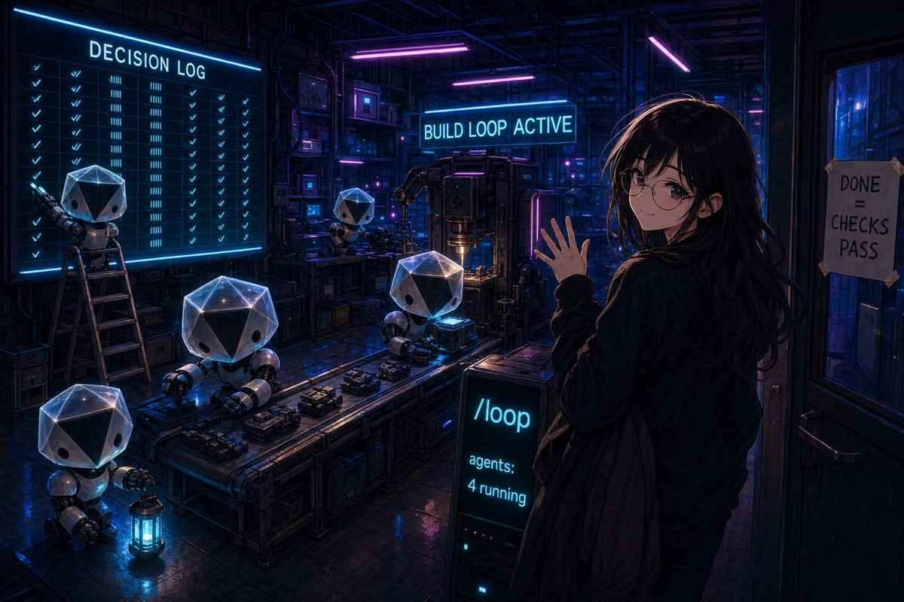
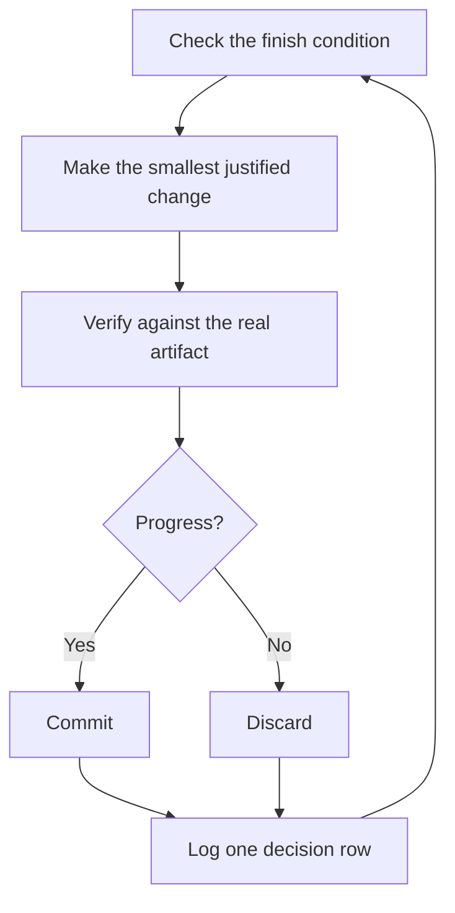

# Run autonomous work

A long autonomous run is safe only when it has a checkable finish condition, an isolated worktree, clear permissions, and a decision log that you can audit.



## The long-run contract

State the goal, finish condition, permissions, and escape condition:

```text
/poteto-mode migrate every caller to the new parser in a fresh worktree off <base>.
done means zero old callers, all parser fixtures pass, and the old API is deleted.
keep a decision log. do not ask me before committing.
continue until done. if you reach a real blocker, stop and report the evidence.
```

Each part has a purpose:

- The finish condition gives every iteration a pass-or-fail check.
- The worktree prevents conflicts with other work.
- The permission statement prevents avoidable pauses.
- The escape condition prevents the agent from weakening the goal to claim success.

OpenCode background subagents report when they finish. The coordinator reacts to those completion events and checks durable evidence such as commits, pushes, PR state, CI, and test output. It does not poll active subagents.

## What each iteration does



One change, one check, and one log row keep the run reviewable. A change that does not help gets removed. The finish condition does not change without your approval.

## Audit the run

[`/show-me-your-work`](../../skills/show-me-your-work/SKILL.md) records the time, phase, decision, reason, evidence pointer, and result in `decisions.tsv`, or `.audit/<task-slug>.tsv` when several runs share a directory. The log stays uncommitted by default.

Ask for a review summary:

```text
/show-me-your-work catch me up on the autonomous run
```

The skill checks the log against the active conversation and produced artifacts. It can read an older project session by exact ID through the plugin's session-context tool.

## Scale from one task to a queue

[Autopilot-full](../../skills/poteto-mode/playbooks/autopilot-full.md) assigns one owner per independent PR and uses fresh verifiers before a merge. Use it only when you explicitly grant merge authority:

```text
/poteto-mode full autopilot on this queue. each item is independent. merge only after a clean verifier verdict.
```

[Autopilot-stack](../../skills/poteto-mode/playbooks/autopilot-stack.md) builds and verifies a linear stack but does not merge it:

```text
/poteto-mode autopilot these changes as one stack. do not merge. i will land it.
```

[Orchestrate](../../skills/poteto-mode/playbooks/orchestrate.md) is for a program that needs several worktrees, PRs, or subagent waves. The coordinator writes briefs, tracks durable state, and aggregates completion results. Use it only when one agent cannot finish the work in one session.

**Pitfall:** a duration is not a finish condition. "Work for four hours" measures motion. Give the run a command or artifact that can pass or fail.

Next: [Steer with principle names](./08-principles.md).
